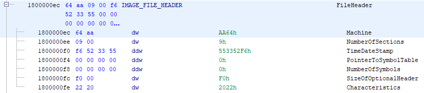
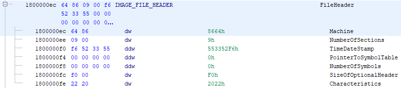
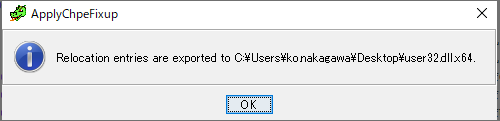

# Ghidra scripts for analyzing CHPEV2 files 

## [ShowChpeFixup.java](./src/main/java/ShowChpeFixup.java)

This script shows the relocation entries of an input CHPEV2 file as shown in the following figure.

## [ApplyChpeFixup.java](./src/main/java/ApplyChpeFixup.java)

This scirpt applies the relocations by `IMAGE_DYNAIC_RELOCATION_ARM64X` to a CHPEV2 file, and saves the applied result as a new file.

NOTE: this script changes the contents of 1. the PE header 2. code in the text section 3. data in the data section.
For example, this script changes `IMAGE_FILE_HEADER.Machine` from AArch64 (0xaa64)

to x86\_64 (0x8664).

You can specify an output directory of the relocation-applied CHPEV2 file by this script.

